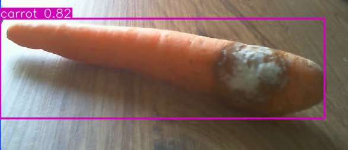
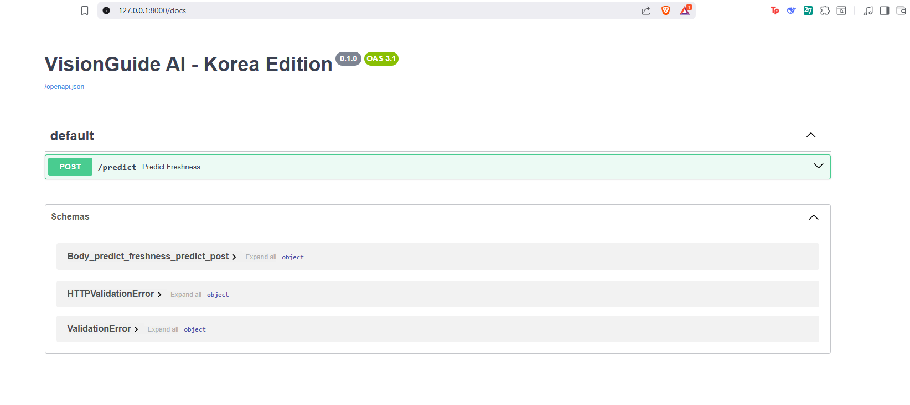

🌍 VisionAssist: AI-Powered Life Assistant
### *Empowering the Visually Impaired with Computer Vision*

 
*YOLOv8 Real-time Detection & Freshness Analysis in Action*

## 📝 Project Overview / 프로젝트 개요
**EN:** VisionAssist is a real-time object recognition and biological decay detection system designed for the visually impaired. Using YOLOv8 and HSV Color Analysis, it not only identifies items like carrots and oranges but also assesses their freshness in the user's native language.

**KO:** VisionAssist는 시각 장애인을 위한 실시간 사물 인식 및 생물학적 부패 감지 시스템입니다. YOLOv8과 HSV 색상 분석을 사용하여 당근이나 오렌지와 같은 품목을 식별할 뿐만 아니라 사용자의 모국어로 신선도를 평가합니다.

---

## 🚀 Key Features / 주요 특징
* **Multi-Language Voice Support:** Optimized for Korean (Hangul), with an architecture ready for global expansion.
* **Freshness Detection:** Advanced algorithm to detect brown rot and white mold using pixel density analysis in HSV space.
* **Dual-Mode Architecture:** Supports both **Edge-AI** (Real-time camera assistant) and **Cloud-AI** (FastAPI backend).
* **Manual Recording [R]:** Instant video capture for sharing or debugging.

---

## 🛠️ Tech Stack / 기술 스택
* **AI:** Ultralytics YOLOv8 (Object Detection)
* **API Backend:** FastAPI (Scalable Web Service)
* **Vision:** OpenCV (Image Processing & HSV Analysis)
* **Speech:** gTTS (Google Text-to-Speech)
* **Logic:** Python Multithreading (Zero-lag performance)

---

## 🖥️ API Integration & Documentation

*Automated Swagger UI Documentation for Global Scalability*

The system includes a **FastAPI** backend (`main.py`) that allows the model to be deployed as a web service. This is a critical feature for integrating VisionAssist into mobile applications and large-scale retail ecosystems.

---

## 📖 How to Use / 사용 방법

### 1. Edge-AI Assistant (Camera Mode)
```bash
python VisionGuide_AI.py
Detection: Point the camera at a carrot or orange.

Feedback: Listen for "Sinsunhan" (Fresh) or "Sseogeun" (Rotten).

2. Cloud-AI Backend (API Mode)
Bash
uvicorn main:app --reload
Visit http://127.0.0.1:8000/docs to test the API with sample images.

🌍 Future Vision
Designed with a global mindset, this project aims to bridge the gap between AI technology and human needs, specifically targeting the South Korean retail market and international accessibility standards.
